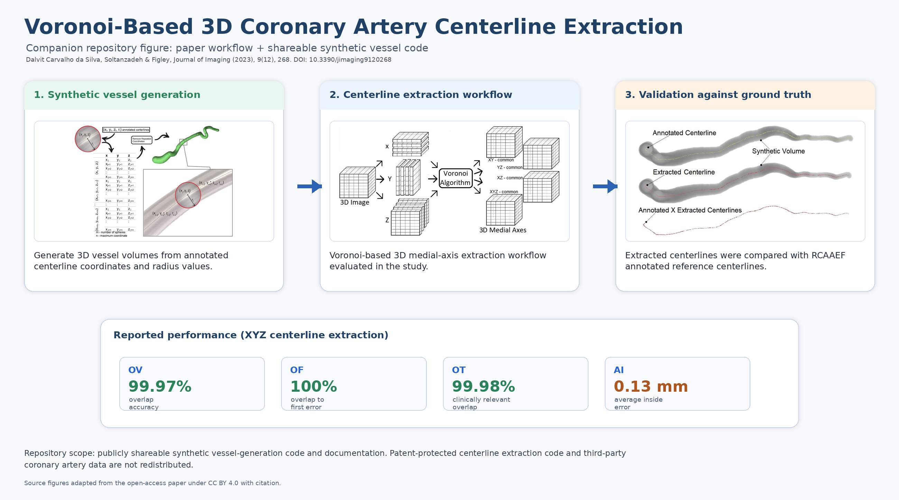

# Voronoi-Based 3D Coronary Artery Centerline Extraction

This repository provides documentation and synthetic vessel-generation code associated with the study:

**Dalvit Carvalho da Silva, R., Soltanzadeh, R., & Figley, C. R. (2023). _Automated Coronary Artery Tracking with a Voronoi-Based 3D Centerline Extraction Algorithm_. Journal of Imaging, 9(12), 268. https://doi.org/10.3390/jimaging9120268**

## Overview

Coronary artery centerline extraction is an important computational step in cardiac CT angiography analysis. Accurate centerlines can support downstream measurements of vessel geometry, branch structure, vessel length, cross-sectional properties, and other features relevant to coronary artery assessment.

The study evaluated a Voronoi-based 3D centerline extraction method for automated coronary artery tracking. The method was tested using synthetically segmented coronary artery models based on the Rotterdam Coronary Artery Algorithm Evaluation Framework training dataset.

The full centerline extraction algorithm is not publicly released in this repository because it is protected by intellectual property and patent-related restrictions. This repository provides documentation, paper-linked materials, and synthetic vessel-generation code that can be shared.

## Graphical summary



## What is included

This repository includes:

- documentation for the published study;
- citation and data-access information;
- a summary of the computational workflow;
- synthetic vessel-generation code described in the paper;
- paper figures used with attribution;
- notes explaining code and data availability.

## What is not included

The following materials are not publicly distributed here:

- patent-protected centerline extraction source code;
- full implementation of the protected Voronoi-based algorithm;
- RCAAEF/CAT08 training data or annotated coronary artery data;
- third-party data that cannot be redistributed by the authors.

Access to restricted code or data may be considered upon reasonable request and subject to institutional, intellectual-property, data-use, and third-party permission requirements.

## Study workflow

The study followed this general workflow:

```text
RCAAEF annotated coronary centerlines
        ↓
Synthetic vessel generation
        ↓
3D segmented coronary artery models
        ↓
Voronoi-based centerline extraction
        ↓
Comparison with ground-truth centerlines
        ↓
Evaluation using OV, OF, OT, and AI metrics
